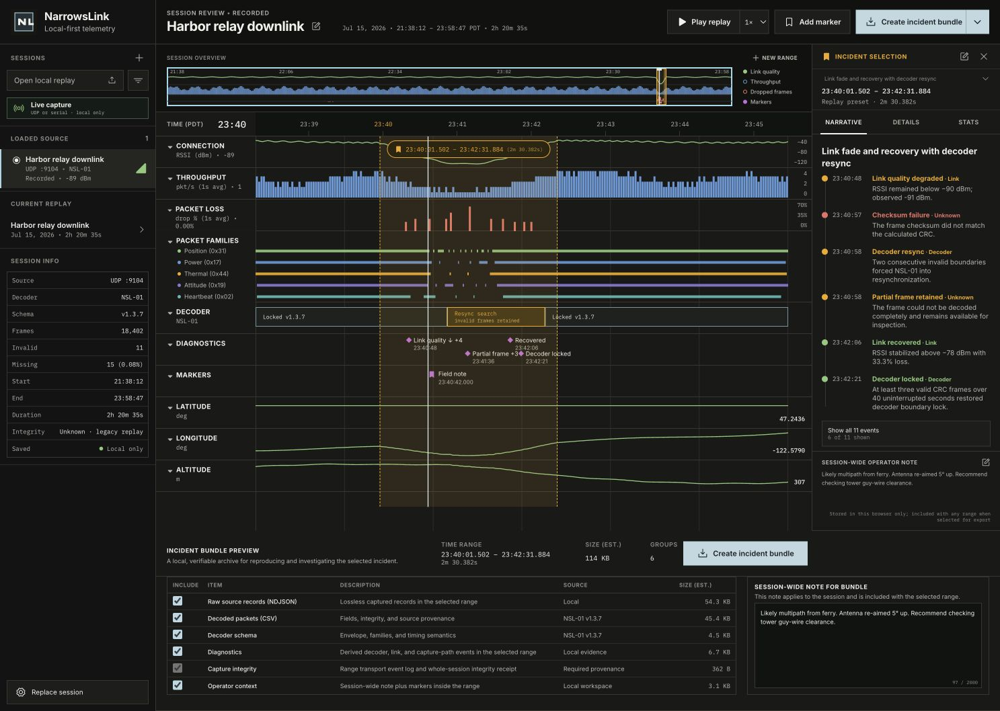
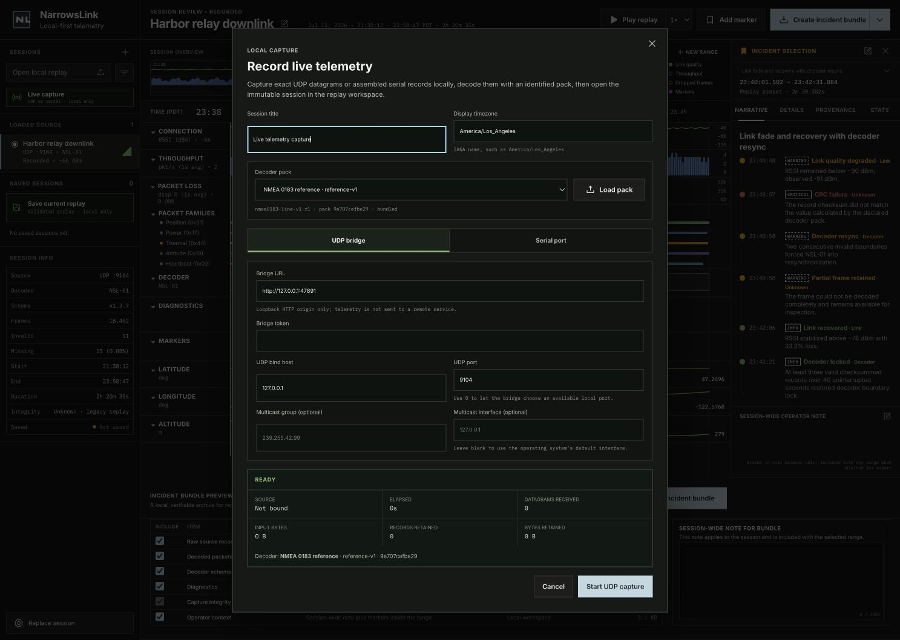
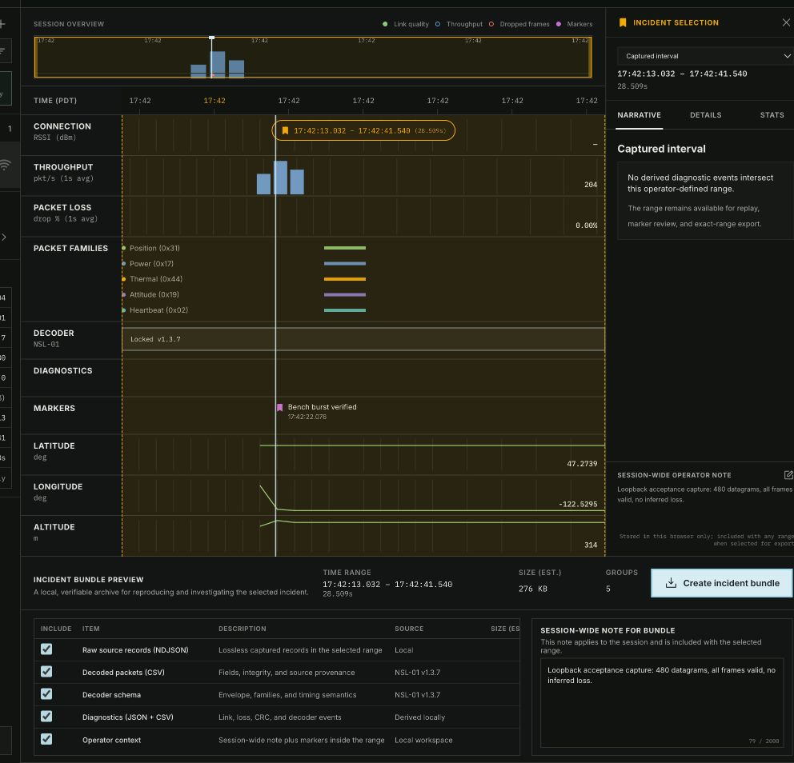

# NarrowsLink

NarrowsLink records live UDP or serial telemetry, turns the capture into an immutable local replay, and provides a synchronized incident-review workspace. Every new capture also carries durable transport anomalies and a terminal integrity receipt. One playhead based on integer microsecond offsets drives link health, packet families, decoder state, diagnostics, markers, and decoded signals; the selected interval can then be exported as a reproducible evidence bundle.



The application is local-first. UDP ingest uses a local Node.js bridge whose token-protected control plane listens only on loopback; its UDP socket binds the operator-selected interface. Serial ingest uses the browser's Web Serial connection. Capture, replay, annotations, and evidence generation stay on the operator's machine. NarrowsLink has no telemetry upload, cloud account, or hosted dependency.

## Workspace at a glance

- The source rail starts a live capture, opens a local replay, and identifies the session that is actually loaded.
- The session overview locates the active time window inside the full recording while separating link quality, received packet rate, inferred missing frames, and markers; **New range** creates an operator-owned incident around the playhead.
- The mission timeline correlates connection health, packet cadence, decoder state, diagnostics, operator markers, and decoded position signals on one shared clock.
- The incident rail explains the selected half-open range with a compact narrative, exact details, statistics, and a session-wide operator note. Local ranges can be renamed, classified, set to exact microsecond boundaries, resized from either timeline, or deleted with confirmation.
- The evidence workspace previews the selected artifact groups and their estimated size before building a checksummed local `.nlb` handoff bundle. Capture integrity is required evidence; after generation, the archive manifest records the exact files, byte sizes, record counts, hashes, and terminal receipt that were emitted.

## What works today

- Records unicast or multicast UDP datagrams through a local Node.js bridge with a loopback-only control API, preserving datagram boundaries, byte counts, monotonic offsets, and server-enforced capture ownership. The UDP listener binds the interface selected by the operator.
- Records NSL-01 serial input directly through Web Serial, reassembling split frames while retaining noise, corrupt boundaries, and incomplete trailing bytes for diagnosis.
- Stops a live source, downloads a versioned `.nlsession`, and opens that exact document through the existing validation and decoder pipeline for immediate replay.
- Finalizes new live recordings as session format v2 with an immutable transport-event log and a reconciled capture-integrity receipt. UDP sequence discontinuities, counter mismatches, bridge and event-stream failures, recorder limits, serial read failures, disconnects, tail-recovery failures, and unconfirmed shutdowns survive save and reopen.
- Never substitutes browser totals for unavailable UDP bridge totals. A missing terminal bridge status remains null and produces incomplete `udp-browser-observed` evidence; low-level recorder finalization without adapter evidence remains incomplete and `recorder-only`.
- Loads the bundled demonstration session or a local NarrowsLink session file through the same validation and decoding pipeline.
- Loads legacy v1 sessions without rewriting them and reports their capture integrity as unknown rather than manufacturing a verified receipt.
- Rejects malformed documents, non-monotonic timestamps, duplicate record IDs, invalid time zones, inconsistent byte counts, and files over the 32 MiB browser safety limit with actionable errors.
- Decodes the NSL-01 frame envelope, CRC-16/CCITT-FALSE integrity, and five built-in packet families: Heartbeat, Power, Attitude, Position, and Thermal.
- Retains checksum failures, missing sync words, truncated frames, and invalid lengths as inspectable diagnostics instead of silently discarding them.
- Requires sustained valid traffic before reporting decoder relock, keeping recovery periods visible instead of converting the first good frame into an immediate success state.
- Uses one monotonic replay clock for play, pause, seek, rate changes, the timeline playhead, current values, diagnostics, and incident context. Times remain integer microsecond offsets from a UTC session start.
- Projects both replay presets and operator-authored incidents into exact half-open ranges (`[startUs, endUs)`) with delivery, inferred missing-frame, signal, jitter, availability, and decode-confidence statistics. Missing-frame estimates use the stronger of available transport-drop counters and trusted decoder sequence gaps without summing the same episode twice.
- Projects durable transport anomalies into the existing Diagnostics lane and incident narrative as `capture-path` evidence, distinct from link, decoder, and unattributed failure domains.
- Creates a 30-second local incident around the playhead, supports exact `HH:MM:SS.ffffff` editing and timeline-handle resizing, and turns a replay preset into an editable local copy rather than mutating the source session.
- Persists operator incident ranges, markers, and notes per session in versioned browser local storage. The original replay stays immutable.
- Builds and downloads a real `.nlb` ZIP archive for the selected incident, with a manifest, exact inclusion list, mandatory range-filtered transport events, the whole-session integrity receipt, and a SHA-256 checksum for every evidence artifact.
- Includes focused automated tests for validation, decoding, replay-clock behavior, range semantics, and deterministic evidence packaging.

## Typical incident workflow

1. Load the bundled fixture or choose **Open local replay** for a `.json` or `.nlsession` file.
2. Select a replay preset or choose **New range** to create a local incident around the playhead. A preset can be refined as a separate local copy.
3. Drag the amber start/end handles for rapid adjustment, or use the incident editor to name the range and enter exact included-start and excluded-end offsets.
4. Use **Play replay**, seeking, and rate controls to inspect the range while correlating Narrative, Details, and Stats with decoder, diagnostic, marker, packet-family, decoded-signal, capture-integrity, and evidence-domain context.
5. Use **Add marker** and the session-wide note to preserve operator context locally.
6. Choose the evidence groups to include and review the estimated archive size; this pre-build preview is not a byte-exact manifest.
7. Select **Create incident bundle** to download the verifiable `.nlb` archive for that exact operator-authored range.

## Run it locally

NarrowsLink requires Node.js 20.19 or newer and npm.

```bash
npm ci
npm run dev
```

Vite prints the local URL when the server is ready. For the full verification suite:

```bash
npm run check
```

`npm run check` runs TypeScript validation, the Vitest suite, and a production build.

## Record live UDP



Start the Vite app, then launch the local bridge in another terminal:

```bash
npm run dev
```

```bash
npm run capture:bridge
```

The bridge prints one JSON line containing its loopback `controlUrl` and a newly generated `token`. In NarrowsLink, choose **Live capture → UDP bridge**, paste those values, select the UDP bind host and port, and start recording. The control API listens only on `127.0.0.1`; the token prevents another local page from controlling the socket.

To exercise the complete flow without hardware, start a capture on `127.0.0.1:9104` and run:

```bash
npm run capture:demo
```

The demo sends 480 exact datagrams from the checked-in fixture. Stop the capture with **Stop, save & replay**; NarrowsLink downloads the `.nlsession`, reopens it, and selects its full captured interval for investigation and evidence export.



For multicast, bind an address in the same IP family and provide the group in the dialog. Bridge defaults can be supplied on the command line, but the dialog's bind host and port are explicit per-capture values; mirror `0.0.0.0` and `9104` there when using this example. `0.0.0.0` listens on every local IPv4 interface, so use a narrower interface address when appropriate.

```bash
npm run capture:bridge -- \
  --udp-host 0.0.0.0 \
  --udp-port 9104 \
  --multicast-group 239.42.91.4
```

Use `npm run capture:bridge -- --help` and `npm run capture:demo -- --help` for all options.

## Record live serial

Choose **Live capture → Serial port**, configure the baud rate, data bits, stop bits, parity, and flow control, then select the device in the browser prompt. Device selection and connection setup are excluded from the capture clock; recording starts only after the port opens.

Web Serial is available in supported Chromium browsers and requires a secure context. Local development on `localhost` or `127.0.0.1` satisfies that requirement; see [MDN's Web Serial guide](https://developer.mozilla.org/en-US/docs/Web/API/Web_Serial_API) for current browser support. NarrowsLink retains undecodable input rather than silently dropping it. Framing and sync failures remain inspectable records; a read error or disconnect produces an incomplete receipt plus an exact capture-path event that remains visible after reopening.

## Browser capability and test matrix

This matrix separates intended capability from verification already performed; it is not a blanket support claim for untested browser and operating-system combinations.

| Workflow | Chromium-based browser | Firefox and Safari | Current verification |
| --- | --- | --- | --- |
| Replay, local import, timeline review, markers, notes, and `.nlb` export | Uses standard browser file, storage, download, and Web Crypto APIs | Expected to use the same standards-based path, but not yet tested | Domain and component tests plus a manual Chromium-based desktop and responsive review |
| Live UDP through the local bridge | Available through the loopback control API and browser SSE client | Architecture does not depend on Web Serial, but these browsers are not yet tested | Automated real-loopback bridge and capture-pipeline tests; capture setup manually exercised in Chromium |
| Live serial | Available only when `navigator.serial` is present and the page is a secure context | Web Serial is normally unavailable; use UDP capture or a supported Chromium browser | Serial adapter and frame-assembly tests; broad hardware/driver coverage remains outstanding |

Expanded cross-browser, device, screen-reader, and `200%` zoom coverage is tracked in [ROADMAP.md](ROADMAP.md).

## Bundled replay

`public/fixtures/harbor-relay-session.json` is a deterministic synthetic session designed to exercise the production pipeline:

- 18,402 source records over 8,435 seconds (2 h 20 m 35 s).
- UTC start at `2026-07-16T04:38:12.000Z`, displayed in `America/Los_Angeles`.
- Historical source metadata for multicast UDP `239.42.91.4:9104`; the app is replaying a file, not opening that socket.
- NSL-01 decoder revision `v1.3.7` with all five built-in packet families.
- Three incident presets covering a link fade and decoder resync, an interference burst, and a clean schema-revision transition.
- Varied deterministic packet cadence, a sustained fade and recovery, intentional missing-frame episodes, CRC failures, missing sync words, and truncated frames for forensic and error-state testing.

Regenerate it from the checked-in source script with:

```bash
npm run fixture:generate
```

## Session file format

The current importer accepts JSON files with `.json` or `.nlsession` extensions using `narrowslink/session` format version 1 or 2. Version 1 remains a strict, unchanged legacy contract. New live recordings use version 2:

```text
Session
├── UTC start, display time zone, and duration in microseconds
├── one source descriptor and one decoder descriptor
├── immutable source records
│   ├── integer offsetUs
│   ├── captured frame bytes as hexadecimal
│   ├── transport provenance and byte counts
│   └── optional RSSI/SNR provenance
├── immutable transport events (v2)
│   ├── point, interval, or session scope
│   ├── UDP, serial, backpressure, limit, or shutdown evidence
│   └── stable identity, severity, and structured counters or codes
├── terminal capture-integrity receipt (v2)
│   ├── verified, incomplete, or unknown assessment
│   ├── stop disposition and event-log completeness
│   └── observed, transport-reported, and retained totals
└── zero or more incident presets using [startUs, endUs)
```

Records must be ordered by nondecreasing `offsetUs`, reference the declared source, fit inside `durationUs`, and declare byte counts that match their hexadecimal payload. Version 2 additionally requires ordered, uniquely identified transport events and a receipt whose retained totals exactly match the records. A verified UDP receipt requires bridge, browser, and recorder parity; a verified serial receipt requires clean stop and retained-byte parity. Format validation is implemented in `src/domain/types.ts` and `src/domain/session.ts`.

Receipt assessment bases state what was actually observed. `udp-bridge-reconciled` includes terminal bridge counters; `udp-browser-observed` leaves unavailable bridge totals null and cannot be verified; `web-serial-observed` reconciles observed serial bytes; and `recorder-only` records that no adapter finalization evidence was supplied. UDP and serial counter disagreements require their own issue code and exact counter evidence. When a bounded event log is complete, every transport issue must have a matching immutable event. If its evidence budget is exhausted, the receipt explicitly marks the log incomplete while preserving the known issue codes and terminal counters.

Imported v1 evidence is not rewritten. Replay normalizes it to an in-memory `unknown · legacy replay` assessment because the original file has no durable capture receipt.


The v1 binary envelope is little-endian after its `A55A` sync word and includes protocol version, family ID, sequence, payload length, device time, payload, and CRC-16/CCITT-FALSE. The canonical built-in schema in `src/domain/decoder.ts` describes every envelope and payload field, including byte offsets, types, scales, units, enums, and bounds. Its descriptor carries the SHA-256 digest of recursively key-sorted canonical schema JSON; a conformance test prevents schema and identity drift. Runtime schema import is not implemented yet.

## Evidence bundle format

An `.nlb` file is an ordinary ZIP archive generated entirely in the browser. Depending on the inclusion controls, it contains:

```text
manifest.json
SHA256SUMS
transport/events.json
transport/integrity-receipt.json
raw/source-records.ndjson
decoded/packets.csv
diagnostics/diagnostics.json
diagnostics/diagnostics.csv
markers/markers.json
notes/notes.json
schema/schema.json
```

Every time-bearing artifact is filtered to the selected half-open range. Point transport events at `startUs` are included and events at `endUs` are excluded; overlapping intervals and session-scoped integrity events are included. `transport/integrity-receipt.json` always describes the whole capture, including an honest unknown assessment for legacy v1 input. These two transport artifacts are mandatory even when every optional evidence group is excluded.

`manifest.json` records the session and decoder identity, full capture-integrity receipt, exact selection, actual inclusions, media types, byte sizes, record counts, and artifact hashes. Those values describe the generated bytes, unlike the selected-group and size estimates shown before generation. `decoded/packets.csv` retains complete integrity JSON for forensic failures, and `schema/schema.json` includes the reproducible byte-level decoder definition. `SHA256SUMS` covers the manifest and each included evidence artifact.

### Verify a bundle independently

An `.nlb` can be checked without NarrowsLink because it is an ordinary ZIP archive with standard SHA-256 checksum lines. Extract into a new directory, then verify from inside that directory:

```bash
mkdir narrowslink-bundle-check
unzip path/to/incident.nlb -d narrowslink-bundle-check
cd narrowslink-bundle-check
shasum -a 256 -c SHA256SUMS
```

On systems that provide GNU Coreutils instead of `shasum`, use `sha256sum -c SHA256SUMS`. Every listed path must report `OK`; otherwise, treat the bundle as modified or incomplete. Then inspect `manifest.json` to confirm the expected session, decoder revision and schema hash, half-open selection, inclusions, file sizes, and record counts.

Checksums establish internal integrity only. Version 2 bundles are unsigned: they do not prove who created the archive or that the NarrowsLink build used to generate it was uncompromised. The receipt proves which capture-integrity checks NarrowsLink could perform and preserves every known anomaly; it cannot rule out failures that the local transport did not expose. Exchange the `.nlb` checksum or the expected manifest identity through a separately trusted channel when provenance matters.

## Architecture

| Area | Responsibility |
| --- | --- |
| `src/App.tsx` | Application state and mission-timeline workspace UI |
| `src/capture/CaptureDialog.tsx` | Live-source configuration, capture lifecycle, integrity status, save, and replay handoff |
| `src/capture/recorder.ts` | Bounded immutable source-record collection and versioned session finalization |
| `src/capture/web-serial.ts` | Permission-aware Web Serial lifecycle and byte-stream reads |
| `src/capture/nsl01-serial-assembler.ts` | NSL-01 framing, noise retention, and bounded resynchronization |
| `src/capture/udp-bridge.ts` | Typed, authenticated browser client for the local UDP bridge |
| `src/data/load-session.ts` | Bundled and user-file loading, size limits, and surfaced load errors |
| `src/data/session-file.ts` | Canonical compact `.nlsession` serializer and shared 32 MiB import/export budget |
| `src/domain/types.ts` | Versioned session schema and core telemetry types |
| `src/domain/decoder.ts` | Frame envelope, CRC, built-in family decoding, and malformed-frame retention |
| `src/domain/session.ts` | Validation, metric derivation, diagnostics, incident projection, and range helpers |
| `src/replay/` | Pure monotonic replay clock and its React subscription hook |
| `src/storage/session-storage.ts` | Versioned per-session operator-range, marker, and note persistence in local storage |
| `src/domain/bundle.ts` | Range-filtered, checksummed `.nlb` evidence generation and browser download |
| `src/lib/telemetry.ts` | Timeline sampling, value lookup, and source-aligned incident view ranges |
| `src/lib/time.ts` | Time-zone-aware presentation and byte-size helpers |
| `scripts/capture-bridge.mjs` | Token-protected loopback control plane, UDP socket, multicast membership, and SSE delivery |
| `scripts/send-demo-udp.mjs` | Replays checked-in fixture records as real UDP datagrams for acceptance testing |
| `scripts/generate-demo-session.mjs` | Deterministic synthetic fixture generator |

Raw source records remain immutable. Frames, fields, metrics, diagnostics, incidents, and bundle artifacts are derived from those records, and the same path is used for the bundled fixture and imported files.

## Privacy and data handling

Serial capture, replay parsing, marker and note persistence, and evidence generation happen locally in the browser. UDP payloads move only from the local socket bridge to the local page. The bridge control plane is loopback-only and token-authenticated; the UDP listener itself binds exactly the interface selected by the operator. NarrowsLink has no account system, analytics service, telemetry upload, or cloud synchronization.

Local does not automatically mean safe to share. A replay or evidence bundle can contain raw bytes, device identifiers, coordinates, signal observations, and operator notes. Review and sanitize captures before committing them or sending them to someone else. Browser local storage is convenient workspace persistence, not an encrypted secrets store.

## Current limits and next steps

- Live capture supports UDP and Web Serial; TCP and other transports are not implemented.
- The serial adapter is intentionally bound to the bundled NSL-01 decoder schema. Decoder families are compiled into the application; external schema loading and protocol plug-ins are next-stage work.
- Sessions are captured, parsed, indexed, and bundled in browser memory. The recorder enforces the same importable-file budget as the 32 MiB replay loader, plus the 100,000-record and 24-hour schema limits.
- New live captures use version 2 durable transport events and integrity receipts; legacy version 1 replays remain supported with an explicit unknown assessment.
- Version 2 does not yet persist each UDP sender endpoint or the bridge's internal capture ID in every source record. It preserves browser-observed bridge errors, event-stream gaps, stop-time counter reconciliation, recorder limits, serial failures, and shutdown disposition. A capture-scoped bridge-side journal and operating-system drop counters remain next-stage provenance work.
- Automated coverage includes capture adapters, the real loopback bridge, decoder/replay behavior, and capture-to-evidence byte/hash verification. Expanded cross-browser and assistive-technology testing remains on the roadmap.

See [ROADMAP.md](ROADMAP.md) for the next milestones and [CONTRIBUTING.md](CONTRIBUTING.md) for development guidance.

For usage help, see [SUPPORT.md](SUPPORT.md). Report vulnerabilities through the private process in [SECURITY.md](SECURITY.md), and review [CODE_OF_CONDUCT.md](CODE_OF_CONDUCT.md) before participating in project spaces.

## License

NarrowsLink is available under the [MIT License](LICENSE).
