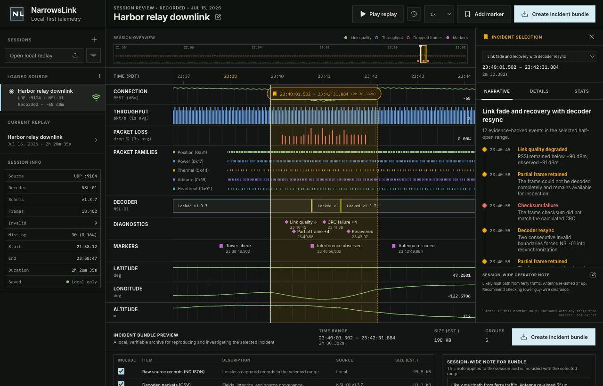

# NarrowsLink

NarrowsLink turns a recorded telemetry session into a synchronized incident review workspace. Load a replay, move one microsecond-accurate playhead across link health, packet families, decoder state, diagnostics, markers, and decoded signals, then export the selected incident as a reproducible evidence bundle.



The current application is a local-first replay tool. It does not yet listen to live UDP or serial sources, upload telemetry, or require a cloud account.

## What works today

- Loads the bundled demonstration session or a local NarrowsLink session file through the same validation and decoding pipeline.
- Rejects malformed documents, non-monotonic timestamps, duplicate records, invalid time zones, inconsistent byte counts, and files over the 32 MB browser safety limit with actionable errors.
- Decodes the NSL-01 frame envelope, CRC-16/CCITT-FALSE integrity, and five built-in packet families: Heartbeat, Power, Attitude, Position, and Thermal.
- Retains checksum failures, missing sync words, truncated frames, and invalid lengths as inspectable diagnostics instead of silently discarding them.
- Uses one monotonic replay clock for play, pause, seek, rate changes, the timeline playhead, current values, diagnostics, and incident context. Times remain integer microsecond offsets from a UTC session start.
- Projects preset incidents into exact half-open ranges (`[startUs, endUs)`) with delivery, loss, signal, jitter, availability, and decode-confidence statistics.
- Persists operator markers and notes per session in browser local storage.
- Builds and downloads a real `.nlb` ZIP archive for the selected incident, with a manifest, exact inclusion list, and SHA-256 checksum for every evidence artifact.
- Includes focused automated tests for validation, decoding, replay-clock behavior, range semantics, and deterministic evidence packaging.

## Run it locally

NarrowsLink requires Node.js 20.19 or newer and npm.

```bash
npm ci
npm run dev
```

Vite prints the local URL when the server is ready. For the full verification suite:

```bash
npm run check
```

`npm run check` runs TypeScript validation, the Vitest suite, and a production build.

## Bundled replay

`public/fixtures/harbor-relay-session.json` is a deterministic synthetic session designed to exercise the production pipeline:

- 18,402 source records over 8,435 seconds (2 h 20 m 35 s).
- UTC start at `2026-07-16T04:38:12.000Z`, displayed in `America/Los_Angeles`.
- Historical source metadata for multicast UDP `239.42.91.4:9104`; the app is replaying a file, not opening that socket.
- NSL-01 decoder revision `v1.3.7` with all five built-in packet families.
- Three incident presets covering a link fade and decoder resync, an interference burst, and a clean schema-revision transition.
- Intentional sequence gaps, CRC failures, missing sync words, and truncated frames for forensic and error-state testing.

Regenerate it from the checked-in source script with:

```bash
npm run fixture:generate
```

## Session file format

The current importer accepts JSON files with `.json` or `.nlsession` extensions using `narrowslink/session` format version 1. At a high level, a document contains:

```text
Session
├── UTC start, display time zone, and duration in microseconds
├── one source descriptor and one decoder descriptor
├── immutable source records
│   ├── integer offsetUs
│   ├── captured frame bytes as hexadecimal
│   ├── transport provenance and byte counts
│   └── optional RSSI/SNR provenance
└── zero or more incident presets using [startUs, endUs)
```

Records must be ordered by nondecreasing `offsetUs`, reference the declared source, fit inside `durationUs`, and declare byte counts that match their hexadecimal payload. Format validation is implemented in `src/domain/types.ts` and `src/domain/session.ts`.

The v1 binary envelope is little-endian after its `A55A` sync word and includes protocol version, family ID, sequence, payload length, device time, payload, and CRC-16/CCITT-FALSE. The canonical built-in schema in `src/domain/decoder.ts` describes every envelope and payload field, including byte offsets, types, scales, units, enums, and bounds. Its descriptor carries the SHA-256 digest of recursively key-sorted canonical schema JSON; a conformance test prevents schema and identity drift. Runtime schema import is not implemented yet.

## Evidence bundle format

An `.nlb` file is an ordinary ZIP archive generated entirely in the browser. Depending on the inclusion controls, it contains:

```text
manifest.json
SHA256SUMS
raw/source-records.ndjson
decoded/packets.csv
diagnostics/diagnostics.json
diagnostics/diagnostics.csv
markers/markers.json
notes/notes.json
schema/schema.json
```

Every time-bearing artifact is filtered to the selected half-open range. `manifest.json` records the session and decoder identity, exact selection, actual inclusions, media types, byte sizes, record counts, and artifact hashes. `decoded/packets.csv` retains complete integrity JSON for forensic failures, and `schema/schema.json` includes the reproducible byte-level decoder definition. `SHA256SUMS` covers the manifest and each included evidence artifact.

## Architecture

| Area | Responsibility |
| --- | --- |
| `src/App.tsx` | Application state and mission-timeline workspace UI |
| `src/data/load-session.ts` | Bundled and user-file loading, size limits, and surfaced load errors |
| `src/domain/types.ts` | Versioned session schema and core telemetry types |
| `src/domain/decoder.ts` | Frame envelope, CRC, built-in family decoding, and malformed-frame retention |
| `src/domain/session.ts` | Validation, metric derivation, diagnostics, incident projection, and range helpers |
| `src/replay/` | Pure monotonic replay clock and its React subscription hook |
| `src/storage/session-storage.ts` | Per-session marker and note persistence in local storage |
| `src/domain/bundle.ts` | Range-filtered, checksummed `.nlb` evidence generation and browser download |
| `src/lib/` | Timeline sampling, value lookup, and time-zone-aware presentation helpers |
| `scripts/generate-demo-session.mjs` | Deterministic synthetic fixture generator |

Raw source records remain immutable. Frames, fields, metrics, diagnostics, incidents, and bundle artifacts are derived from those records, and the same path is used for the bundled fixture and imported files.

## Privacy and data handling

Replay parsing, marker and note persistence, and evidence generation happen locally in the browser. NarrowsLink has no account system, analytics service, telemetry upload, or cloud synchronization.

Local does not automatically mean safe to share. A replay or evidence bundle can contain raw bytes, device identifiers, coordinates, signal observations, and operator notes. Review and sanitize captures before committing them or sending them to someone else. Browser local storage is convenient workspace persistence, not an encrypted secrets store.

## Current limits and next steps

The current release is intentionally replay-first:

- Input is the version 1 JSON session format; live UDP, serial, TCP, and session recording are not implemented.
- Decoder families are compiled into the application; external schema loading and protocol plug-ins are next-stage work.
- Files are parsed, indexed, and bundled in browser memory, with a 32 MB file limit, a 100,000-record schema limit, and a 24-hour session-duration limit.
- The test suite covers pure domain behavior, but full browser end-to-end and expanded accessibility testing remain on the roadmap.

See [ROADMAP.md](ROADMAP.md) for the next milestones and [CONTRIBUTING.md](CONTRIBUTING.md) for development guidance.

## License

NarrowsLink is available under the [MIT License](LICENSE).
