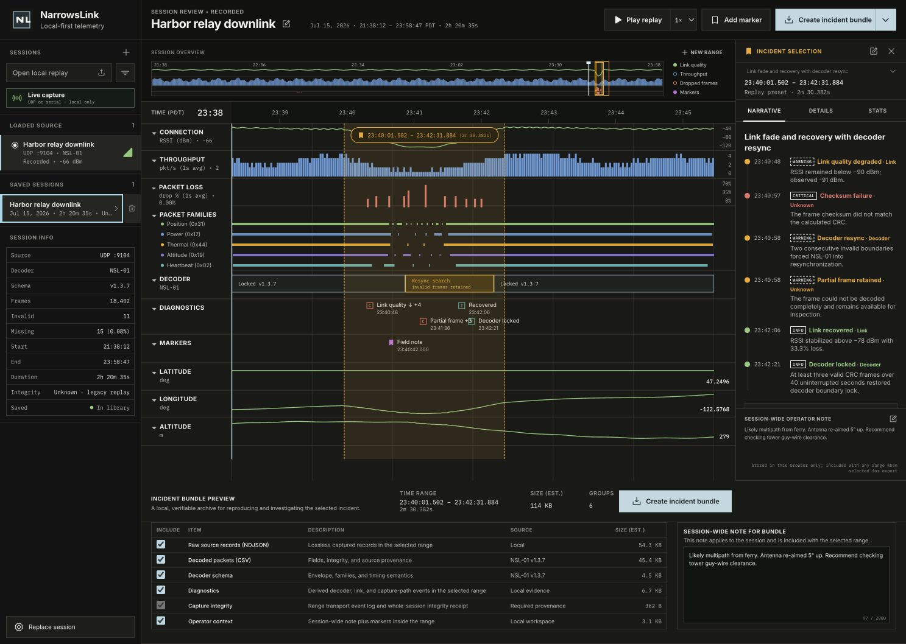
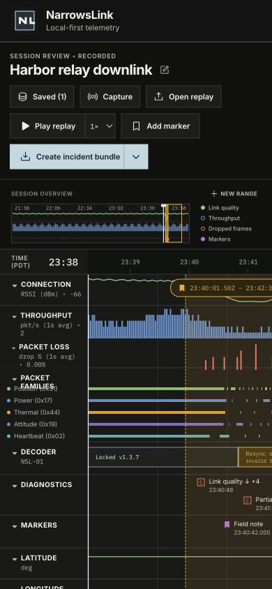
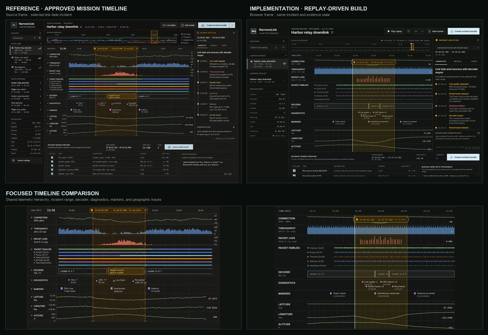
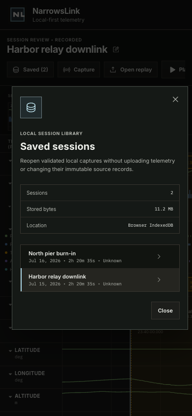
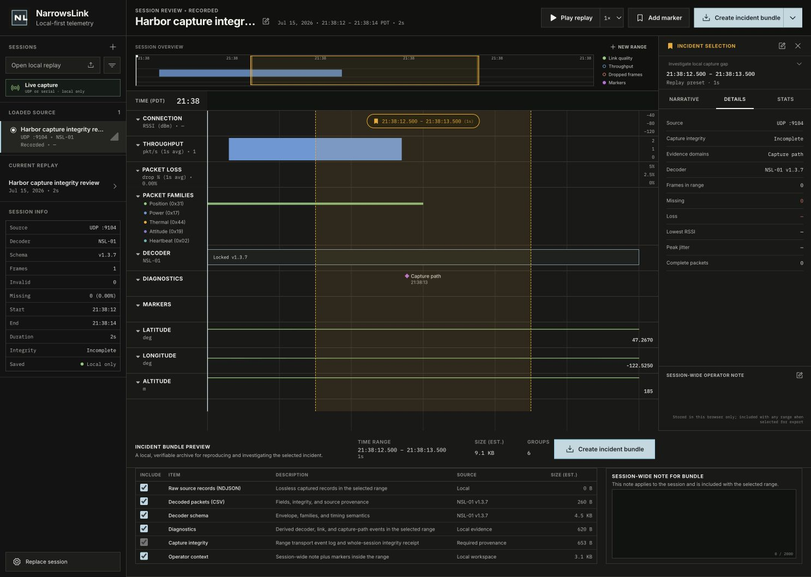

# NarrowsLink Design QA

This document records the currently accepted visual baseline and its verification evidence. Historical product changes belong in [CHANGELOG.md](CHANGELOG.md), and planned visual work belongs in [ROADMAP.md](ROADMAP.md).

## Comparison target

- Source visual truth: [mission-timeline source](docs/design/narrowslink-mission-timeline-source.png)
- Current browser-rendered implementation: [release desktop implementation](docs/design/implementation-release-desktop.png)
- Current responsive implementation: [release mobile implementation](docs/design/implementation-release-mobile.png)
- Accepted source/geometry comparison from the preceding equivalent workspace state: [full comparison](docs/design/comparison-production-final.png)
- Accepted focused source/geometry comparison: [focused comparison](docs/design/comparison-production-focused.png)
- Responsive session-library dialog evidence: [responsive library implementation](docs/design/implementation-functional-mobile.png)
- Capture-integrity functional evidence: [incomplete UDP capture replay](docs/design/implementation-capture-integrity.png)
- Desktop viewport: `1487 × 1058`, matching the source image.
- Responsive viewport: `390 × 844`; measured document width and scroll width both equal `390 px`, and the open library dialog measures `358 px` wide.
- State: bundled Harbor relay replay reopened from the library; replay paused inside the link-fade incident at `23:40`; Narrative tab; all six evidence groups selected; two genuine saved sessions; two local operator markers, one in the visible timeline; and a session-wide note present.
- Release-gate state: the same bundled incident and operator note with one genuine saved session, visible non-color diagnostic severity tokens, selected-incident semantics, and all six evidence groups selected.

### Current release result

### Accepted desktop comparison

### Accepted responsive result

### Accepted capture-integrity result

## Final findings

No actionable P0, P1, or P2 visual findings remain.

The final implementation matches the source's primary composition and geometry: `232 px` source rail, compact session command bar, stacked overview plots, shared time grid, labeled telemetry lanes, `280 px` incident rail, amber half-open incident selection, and the full-width evidence workspace. The interface also retains square controls, quiet one-pixel structure, restrained warm-black surfaces, dense instrument typography, semantic chart colors, and a pale-blue export action.

Six visible differences are intentional and accepted product, data, or accessibility constraints:

- The source mocks several active and recent sessions. The implementation shows one genuine loaded source plus two genuinely persisted sessions and does not present invented sessions as available data.
- The source shows a live-follow control. A recorded session truthfully exposes replay controls, while live capture remains available from the source rail and command bar.
- Packet-family gaps, decoder resynchronization, diagnostics, estimates, and bundle metadata are derived from the validated fixture rather than copied as decorative source values.
- Evidence rows describe the real local NarrowsLink archive contents and sizes rather than the source's illustrative PCAP and `24.7 MB` copy.
- The evidence table has a sixth required Capture integrity row so optional derived diagnostics remain independently selectable while the transport event log, provenance document, bridge journal, and receipt cannot be removed from a verifiable archive.
- Diagnostics add visible severity words or compact `C`/`W`/`I` tokens, and overview incidents expose selected-state treatment, so meaning is not carried by color alone.

## Focused comparison evidence

- Timeline: the final comparison confirms equivalent label and scale gutters, minute-aligned ticks, connection/received-packet-rate/inferred-missing-frame order (labeled Connection, Throughput, and Loss in the UI), five packet-family bands, extended decoder-resync state, diagnostic and marker lanes, geographic traces, and selected-range treatment.
- Incident rail: the final comparison and current release evidence confirm equivalent range summary, selector, semantic tabs, compact chronological narrative, visible non-color severity tokens, and session-wide operator-note region.
- Evidence workspace: the current full and focused comparisons confirm the summary-to-table hierarchy, operator context, estimated size/group count, source-aligned primary export placement, and a fully visible six-row table. Optional Diagnostics remains independently selectable while the sixth Capture integrity row is required.
- Source rail and header: widths, dividers, title/meta hierarchy, compact replay actions, loaded-source navigation, live capture, and dense real saved-session rows align with the prototype without fabricating availability.
- Session library: the current desktop and responsive evidence confirms two real IndexedDB entries, active-row treatment, meaningful date/duration/integrity metadata, guarded removal, a reachable narrow-screen dialog, and no horizontal body overflow.
- Capture integrity: the functional evidence confirms that an incomplete v2 receipt is visible in session context, its immutable UDP anomaly appears in the shared Diagnostics lane and Narrative as `Capture path`, and the evidence workspace keeps Capture integrity mandatory while Diagnostics remains optional.
- Transport provenance: a verified loopback capture confirms that the source-aligned incident rail can expose capture identity, bound socket, endpoint attribution, bridge totals, explicit unavailable kernel-drop evidence, lifecycle journal entries, and evidence boundaries without disturbing the mission timeline's density or hierarchy.

## Required fidelity surfaces

- Fonts and typography: bundled Inter carries interface copy and IBM Plex Mono carries times, values, and protocol metadata. Uppercase micro-labels, numeric alignment, weight, and dense line heights were checked in the focused comparison.
- Spacing and layout rhythm: the viewport, rail and incident-panel widths, header and overview heights, label/scale gutters, lane baselines, evidence proportions, dividers, and square corners were compared against the source at identical dimensions.
- Colors and visual tokens: warm near-black surfaces, muted gray structure, amber incident selection, green link/position data, blue received packet rate, red inferred missing frames, purple markers, cyan packet-family data, and pale-blue primary actions preserve the source semantics.
- Image and icon fidelity: the repository's NarrowsLink mark is reused as a real image asset. The source contains no photography or illustration. Recharts renders data plots and Phosphor supplies the icon family; no placeholder art, emoji, or improvised CSS/SVG illustration was introduced.
- Copy and content: session metadata, diagnostics, units, decoder state, bundle contents, and privacy language remain coherent and derived from the same replay pipeline instead of reproducing contradictory prototype numbers.
- Responsiveness: at `390 × 844`, the page has no horizontal body overflow, labels no longer collide, the command strip and Saved control remain reachable, the `358 px` library dialog fits the viewport, the telemetry surface uses its deliberate internal scroller, and panels preserve the desktop hierarchy.
- Accessibility review: semantic buttons, native checkboxes/selects, labels, tabs, dialogs, focus treatment, status text, chart summaries, disabled states, reduced-motion behavior, non-color diagnostic cues, and narrow keyboard scrollers pass axe rules tagged WCAG A/AA plus interaction coverage in Playwright Chromium, Firefox, and WebKit. All three engines pass `960`, `640` (`200%`-equivalent), and `390` CSS-pixel reflow plus forced-color checks. This is not a claim of full accessibility compliance; packaged-browser screen-reader, native zoom, and hardware matrices remain manual follow-up work documented in [ACCESSIBILITY.md](ACCESSIBILITY.md).

## Primary interactions tested

- Played and paused the replay and changed speed to `2×`; the monotonic replay state updated as expected.
- Opened and closed the marker dialog.
- Switched from Narrative to Details and restored Narrative.
- Created an operator incident with exact `HH:MM:SS.ffffff` start/end values, confirmed `[start, end)` duration copy, and verified its projected empty-diagnostic state.
- Adjusted an authored start boundary from the overview with the keyboard; the timeline, incident rail, statistics, and bundle preview updated from the same range.
- Reloaded the page and confirmed the authored range survived versioned per-session local persistence.
- Renamed and extended the range in the shared editor, then exercised the guarded delete flow and kept the sample range.
- Built and downloaded a `15.2 KB` `.nlb` for the exact authored range; the success state reported the generated filename and verifiable local evidence.
- Imported a purpose-built v2 UDP failure replay and confirmed the incomplete receipt, sequence-discontinuity event, exact capture-path diagnostic, and narrative entry survived reopen and projected into the selected incident range.
- Built and downloaded `capture-integrity-browser-review-capture-integrity-incident.nlb`; the success state reported six selected groups and verifiable local evidence with Capture integrity locked on while Diagnostics remained independently selectable.
- Opened and closed the live UDP/serial capture setup.
- Saved the bundled replay, reloaded the page, and confirmed its genuine IndexedDB row and active state survived browser navigation.
- Imported the exact same fixture and confirmed content-addressed deduplication kept the library at one entry and preserved the original saved order.
- Added a second validated session through the real repository path, confirmed newest-first ordering, reopened it from the rail, switched away and back, and verified its per-session operator note restored.
- Exercised removal confirmation and cancellation with keyboard focus, deleted the active library copy while keeping its replay and note in memory, restored the same session document, and confirmed the deleted workspace note did not resurrect.
- Opened and closed the responsive Saved `(2)` dialog at `390 × 844`; focus moved to the labeled heading and returned to the Saved control, with document and body widths both measuring `390 px`.
- Verified the final desktop document is exactly `1487 × 1058` with no page overflow.
- Verified the operator range editor at `390 × 844`; exact boundary fields stack cleanly and the primary action remains visible.
- Checked browser warnings and errors after the complete session-library flow: none.
- Checked and saved the capture-integrity replay at a `1487 × 1058` browser viewport with no document overflow; the header, required Capture integrity row, and all optional evidence controls remain visible in the accepted frame.
- Recorded 12 real fixture datagrams through an ephemeral loopback UDP bridge, stopped with verified v2 integrity, saved and reimported the `.nlsession`, replayed it, authored an exact half-open range plus marker and note, and independently verified every `.nlb` path, boundary, byte count, record count, manifest hash, and `SHA256SUMS` entry.
- Recorded a 24-datagram loopback acceptance capture and visually confirmed the verified Provenance tab reconciled all 24 records and 737 retained bytes to one exact remote endpoint and a clean two-entry bridge journal while preserving the unavailable host-drop-counter boundary.
- Exercised simulated Web Serial device selection through four fragmented reads, retained four complete frames and one terminal partial frame without byte loss, saved and deduplicated the canonical v2 session, reopened and replayed it from IndexedDB, authored an exact half-open range, and verified the downloaded `.nlb` with the production receiver in Chromium, Firefox, and WebKit. Physical device, driver, and native permission behavior remains a manual boundary.
- Repeated the capture-to-evidence, replay/library, failure-recovery, axe rules tagged WCAG A/AA, focus-handoff, responsive, keyboard-scroller, and forced-color gates in Playwright Chromium, Firefox, and WebKit.
- Ran `npm run check`: TypeScript validation, `219` tests across `20` files, the production Vite build, and all `33` Playwright checks across Chromium, Firefox, and WebKit passed.

## Implementation checklist

- [x] Preserve the approved mission-timeline composition and instrument-grade visual language.
- [x] Match source and implementation at the same viewport and replay state.
- [x] Keep the fixture and imported sources on the same validation, decode, replay, incident, and export pipeline.
- [x] Preserve malformed and partial frames as inspectable diagnostics.
- [x] Preserve capture-path anomalies, endpoint or device provenance, bridge journal, and terminal integrity receipt through replay, operator range projection, and checksummed export.
- [x] Populate the source rail with real durable sessions and preserve validated reopen, explicit removal, and responsive access.
- [x] Gate the full capture-to-evidence loop, independent archive verification, storage failures, keyboard focus, and automated accessibility across the supported browser-engine matrix.
- [x] Verify desktop, responsive, and primary interaction states.
- [x] Resolve every P0, P1, and P2 visual QA finding.

**Result: passed.**
